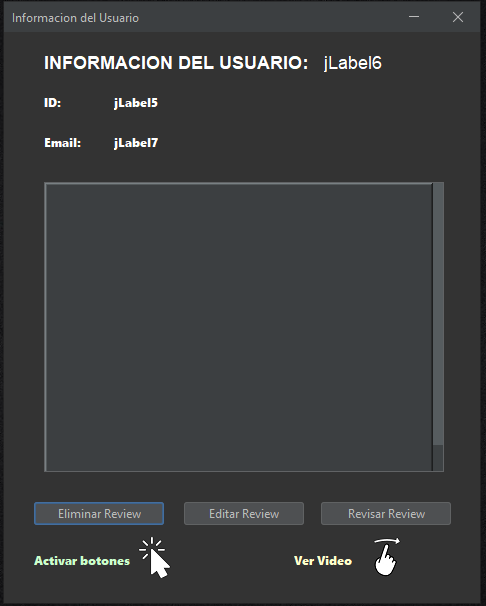
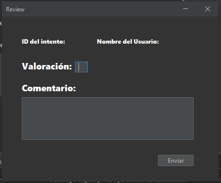

#  FITNOW | MANUAL DE USUARIO

*   [TABLA DE CONTENIDO](#index)
    *   [1. Introducción](#intro)
    *   [2. Pantalla de login](#login)
    *   [3. Pantalla de registro](#registro)
    *   [4. Pantalla principal](#main)
    *   [5. Pantalla de información de intento](#attemptinfo)
    *   [6. Pantalla de información de usuario](#userinfo)
    *   [7. Pantalla de valoración de intento](#attemptreview)
    *   [8. Pantalla de segunda valoración](#secondreview)
    *   [9. Pantalla de intento sin valoración](#noattempt)
    *   [10. Información adicional y siguientes pasos](#next)

<h2 id="intro">1. Introducción</h2>

Este manual está diseñado para ofrecerte una guía clara y concisa sobre cómo utilizar las distintas funcionalidades de la app de **FITNOW**.

El propósito de este manual es proporcionarte instrucciones detalladas sobre cómo navegar por la aplicación y realizar diversas actividades relacionadas con el fitness de manera efectiva.

Nuestra aplicación es fácil de usar e instalar. A lo largo de este manual, encontrarás explicaciones paso a paso sobre cómo utilizar cada una de las funciones principales de la aplicación.

Esperamos que este manual te sea útil y te ayude a utilizar nuestra aplicación móvil de fitness de manera sencilla y sin complicaciones.

<h2 id="login">2. Pantalla de login</h2>

Al iniciar la app, la primera pantalla que nos encontramos es la `Pantalla de login`. En esta pantalla, deberás introducir las credenciales de acceso (tu correo electrónico y contraseña). Finalmente, tras verificar que los datos introducidos son correctos al pulsar el botón de `iniciar sesión`, la app te mostrará la [4. Pantalla principal](#main) con tus datos y ejercicios.

<blockquote>
    
<strong>NOTA:</strong> Si es la primera vez que utilizas la app, deberás crear tu cuenta antes en la <strong>Pantalla de registro</strong>, proporcionando tus datos para crear tu perfil de usuario.

</blockquote>

<h2 id="registro">3. Pantalla de registro</h2>
Esta pantalla se mostrará para que puedas crear tu cuenta de usuario, pudiendo así poder conocerte un poco mejor y guardar el progreso que vayas realizando.

Introduce tu nombre, correo electrónico y tu contraseña y al clickar en el botón `Registrarse`, crearás tu cuenta. Este paso tendrás que hacerlo la primera vez que utilices la app de **FITNOW**.

<h2 id="main">4. Pantalla principal</h2>

Tras validar tus datos de acceso, accederás a la `Pantalla principal`. En esta pantalla verás toda la información de los distintos usuarios de la app, sus intentos pendientes de tu valoración, así como la gestión de sus cuentas. 

**Gestión de usuarios:**
Esta pantalla te permite gestionar los distintos ejercicios que los usuarios han subido a la app, pudiendo ver las valoraciones realizadas o crear una nueva valoración si fuese necesario:

**Intentos pendientes:**
La app también te permite realizar las valoraciones y comentarios de los distintos ejercicios que encontrarás en la tabla de intentos.

Pulsa el botón `valorar` para navegar al panel de [7. Pantalla de valoración de intento](#attemptreview) y poder realizar tu valoración. Si deseas únicamente ver información de un ejercicio en concreto, pulsa el botón `info` que te llevará a la pantalla de [5. Pantalla de información de intento](#attemptinfo).

También podrás visualizar de forma automática el video del primer ejercicio el reproductor de video de la parte derecha. Pulsa el botón `Reproducir/Pausar` para controlar la reproducción del vídeo.

<blockquote>
    
<strong>NOTA:</strong> Si deseas finalizar la sesión, bastará con pulsar el botón de <strong>Cerrar Sesion</strong> situado en la esquina superior derecha.

</blockquote>

<h2 id="attemptinfo">5. Pantalla de información de intento</h2>

Esta pantalla te mostará todos los detalles del ejercicio, para que puedas saber:

* ID del intento
* ID del usuario que lo ha ejecutado
* Nombre del usuario
* ID que identifica el ejercicio
* Nombre del ejercicio
* Fecha y hora de inicio del ejercicio
* Fecha y hora del fin del ejercicio
* Nombre del fichero de vídeo

Al cerrar la ventana, volverás a visualizar la [4. Pantalla principal](#main) con los demás ejercicios para que puedas seguir valorando las demás tareas pendientes.

<h2 id="userinfo">6. Pantalla de información de usuario</h2>

Aquí podrás ver los datos específicos de un usuario en concreto, incluyendo su nombre, ID y su dirección de correo electrónico. Además, podrás gestionar las valoraciones de los ejercicios con los distintos botones:

- **Eliminar Review:** Este botón eliminará la valoración realizada para un ejercicio en concreto

- **Editar Review:** Puedes modificar una valoración de un ejercicio pulsando este botón, que te llevará a la [8. Pantalla de segunda valoración](#secondreview).

- **Revisar Review:** Para poder visualizar una review realizada en la [5. Pantalla de información de intento](#attemptinfo).

- **Activar botones:** Pulstando este icono se habilitarán los botones de gestión de las reviews

- **Ver Video:** Desliza el dedo por la pantalla para poder reproducir el video 

<h2 id="attemptreview">7. Pantalla de valoración de intento</h2>

Esta pantalla te permitirá realizar las valoraciones de cada ejercicio. El panel informativo te muestra los datos del usuario y del ejercicio que se va a valorar.

    Introduce tus comentarios en el campo de texto y el usuario podrá ver tus sugerencias y valoraciones.

<h2 id="secondreview">8. Pantalla de segunda valoración</h2>
Si un ejercicio que no ha sido superado necesita una segunda valoración, se accederá a esta pantalla. Desde aquí podrás visualizar el identificador del intento y el usuario que ha realizado el ejercicio.

Introduce la nueva valoración, un nuevo comentario y pulsa `Enviar` para poder finalizar la nueva valoración.

<h2 id="noattempt">9. Pantalla de intento sin valoración</h2>

En esta pantalla podrás valorar el intento realizado por el usuario, así como proporcionar tus comentarios que justifiquen la decisión tomada.

<blockquote>
    
<strong>NOTA:</strong> Recuerda que es importante proporcionar un mensaje positivo y de refuerzo, animando al usuario a que continúe trabajando para mejorar su rendimiento.

</blockquote>

<h2 id="next">10. Información adicional y siguientes pasos</h2>

Visita la web de [FITNOW](https://paucasesnovescifp.cat/) para más información y obtener detalles más específicos y técnicos.

**Powered By `Zenon Perez` with Java and Github **
